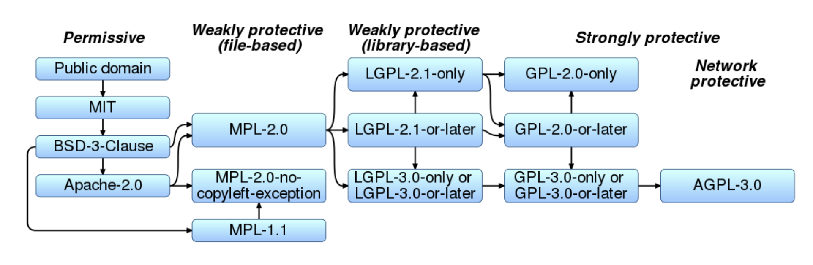
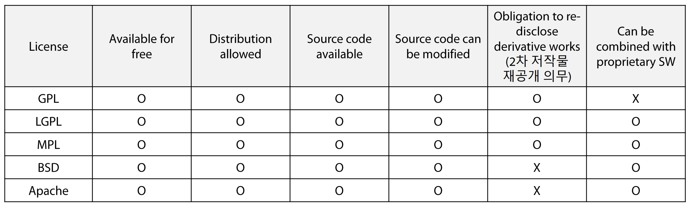
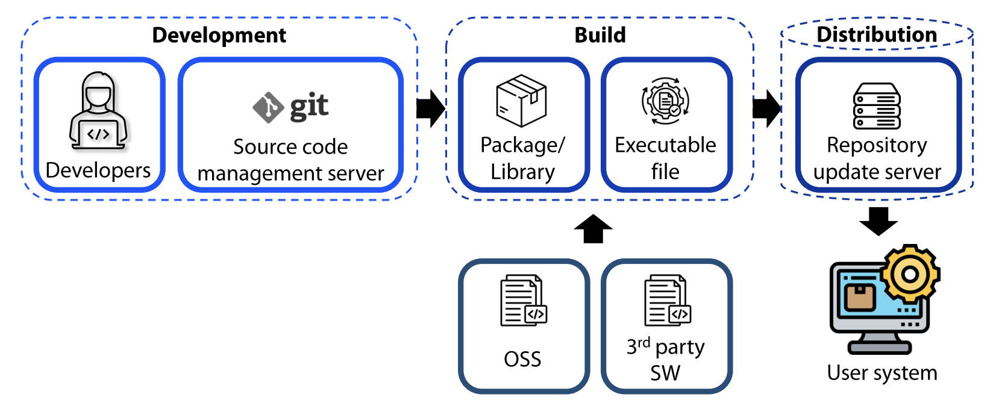
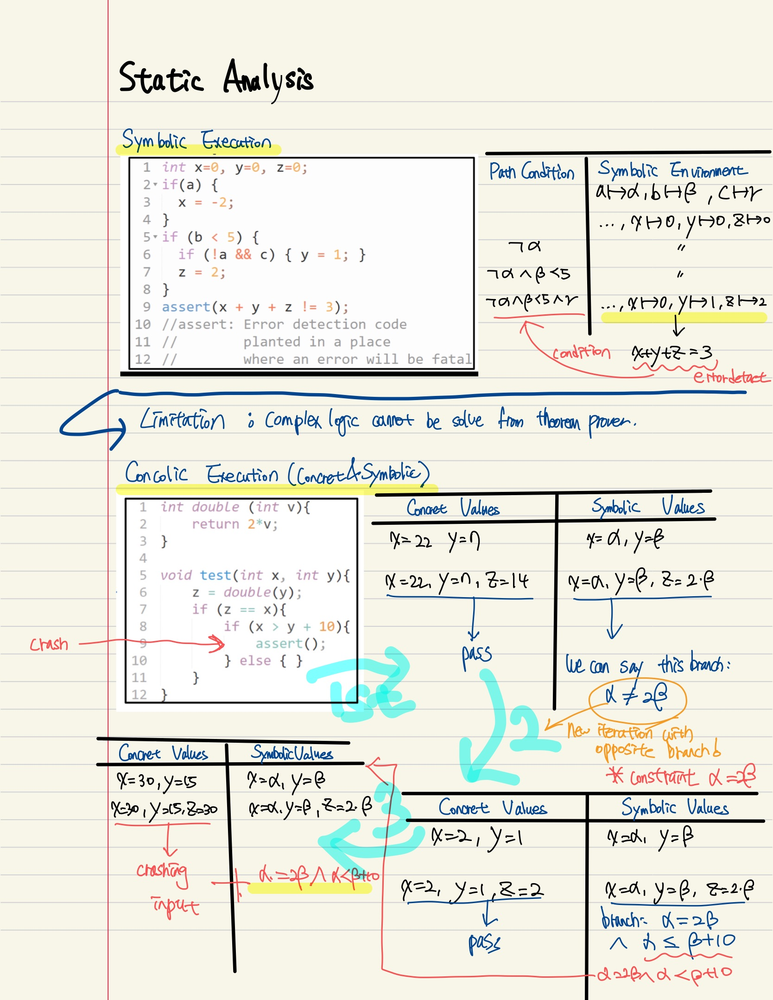

# Software Security (2/2)

## Open Source Security

### OSS (Open Source Software)

Open source software (OSS) is software that is distributed with its source code, making it available for anyone to use, modify, and distribute. However, it must comply with the rules of its specific license.

Each license has its own set of rules regarding the use, modification, and distribution of the software.

Among these, the most restrictive license is the GPL (General Public License), which requires any modified program that reuses OSS under this license to also be licensed under the GPL.

As illustrated, these licenses can conflict with one another. To resolve such conflicts, you can choose to:

1. Separate the design to ensure that the scope of each license does not overlap.
2. Switch to another OSS with a compatible license.
3. Build an in-house solution instead of using conflicting OSS.

### Vulnerabilities in OSS

Since the source code of OSS is public, numerous third parties can review, detect, and report security issues, enhancing its security.

The Common Vulnerabilities and Exposures (CVE) system is a mechanism that allows anyone to discover vulnerabilities in OSS, report them, and receive a CVE ID.

However, the reuse of OSS, where one open-source software incorporates another, can introduce security issues if the latest patches are not applied, or if vulnerabilities are inherited from sub-components. This can lead to vulnerable situations.

- **0-day vulnerability**: A vulnerability that has been discovered but for which a patch has not yet been released.
- **1-day vulnerability**: A vulnerability that has been discovered and a patch has been announced, but the patch has not yet been applied.

For 1-day vulnerabilities, there are two primary approaches to response:

1. **Version-based approach**: Check the OSS name and version to see if the vulnerability has been discovered in that specific version.

   - **Cons**: This approach can result in false positives, as not all instances of the same name and version necessarily contain the exact vulnerability.

2. **Code-based approach**: Search for the specific vulnerable code syntax or pattern.
   - **Cons**: This approach can lead to false negatives, as the vulnerability might be present in slightly modified code that this method cannot detect.

Therefore, the modified reuse of open-source software complicates the detection of vulnerabilities.

## Malicious Software

### Viruses

A virus is a program that can infect other programs or files by modifying them. It usually attaches to an executable file to be triggered. Initially, it remains inactive until the host program runs. Then, during the infection (or propagation) stage, it spreads by cloning itself and infecting other programs. When a specific trigger occurs, such as running the host program executable, the virus executes its malicious actions.

Viruses are usually difficult to detect, but using integrity checks (comparing the hash of a program against a whitelist), behavior signatures (monitoring pre-run behaviors), and malware signatures (detecting known malware patterns) can help identify them.

### Worms

Unlike viruses, worms are independent software programs that can propagate automatically without the need for a host program. They spread through networks and can infect multiple systems without user interaction.

### Trojan Horses

Trojan horses contain both malicious and legitimate functions. Rather than copying themselves to spread, they execute the malicious function already installed when the software is first run. Trojans often disguise themselves as useful or benign software to deceive users into installing them.

### Backdoors

Backdoors are secret access points that allow attackers to bypass normal authentication mechanisms, giving them unauthorized access to systems and data. They can be installed by malware or left by developers, intentionally or accidentally.

### Ransomware

Ransomware prevents access to files by encrypting them. Attackers then demand a ransom from the victim to provide the decryption key, effectively holding the data hostage until payment is made.

## Supply Chain Security

Every component of the software supply chain impacts the security of open-source software. Ensuring the integrity and security of each component is crucial to maintaining the overall security of the software.

### Software Bill of Materials (SBOM)

A Software Bill of Materials (SBOM) helps detect license compatibility issues and identify 1-day vulnerabilities by tracking dependent OSS versions and referencing code. SBOMs provide a detailed inventory of all components in the software, making it easier to manage and secure the supply chain.

## Defense Strategies

### Static analysis

Symbolic Execution and Concolic Execution

Traditional execution is within the given concret input, you execute and get the output. But this doesn't tell anything about common behavior of program within the larget set of input.

Symbolic Execution is within the given symbolic value as input, and following the branches by cases by conditions with symbol

### Dynamic analysis
